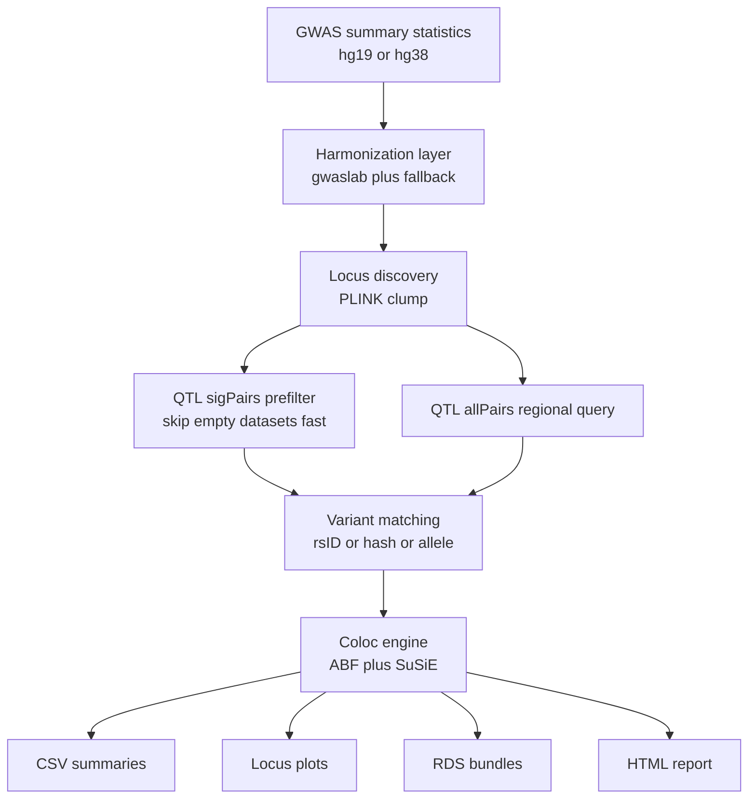

# EasyColoc

EasyColoc is a coloc pipeline for the two problems that slow most real GWAS to
QTL analyses down:

1. Most public GWAS summary statistics still arrive in messy `hg19`-era formats.
2. Many coloc workflows stop at `coloc.abf` and never produce `SuSiE` results.

EasyColoc standardizes GWAS inputs, matches them to tabix-indexed QTL data, and
returns both ABF and SuSiE coloc outputs with plots, manifests, and an HTML
report.

## Why EasyColoc

- `hg19` and `hg38` GWAS support with harmonization and fallback handling
- ABF + SuSiE in one pipeline instead of ABF-only coloc
- Build-aware 1000 Genomes bootstrap for `hg19` and `hg38`
- GTEx metadata bootstrap that can generate QTL summary CSVs and a ready-to-use YAML
- Managed runs with runtime heartbeat, manifest, monitor snapshot, and completion checks
- Demo mode that creates a tiny self-contained project and runs to HTML report

## 2-Minute Quickstart

### 1. Self-contained demo

```bash
./easycoloc bootstrap-refs --demo ./demo_quickstart --run
```

This creates a tiny chr22 project, runs the pipeline end to end, and writes:

- `results/coloc_report.html`
- `results/all_colocalization_results.csv`
- `results/all_susie_results.csv`

### 2. Inspect requirements

```bash
./easycoloc refs
./easycoloc doctor
```

### 3. Build a real reference panel

```bash
./easycoloc bootstrap-refs --setup-1kg ./refs/1kg_phase3_hg19 --build hg19 --pop EAS --chromosomes 1-22
./easycoloc bootstrap-refs --setup-1kg ./refs/1kg_phase3_hg38 --build hg38 --pop EAS --chromosomes 1-22
```

### 4. Prepare GTEx metadata

```bash
./easycoloc bootstrap-refs \
  --fetch-gtex-meta ./refs/gtex_meta \
  --gtex-eqtl-dir /path/to/gtex/eqtl \
  --gtex-sqtl-dir /path/to/gtex/sqtl
```

This downloads the GTEx sample attributes file, builds summary CSVs, and
generates `qtl_gtex_generated.yaml`.

## Architecture



See [ARCHITECTURE.md](/mnt/share_group_folder/work/EasyColoc/docs/ARCHITECTURE.md) for a fuller description.

## Main Commands

```bash
./easycoloc run --managed
./easycoloc check /path/to/output_dir
./easycoloc status /path/to/output_dir
./easycoloc monitor /path/to/output_dir
./easycoloc manifest /path/to/output_dir
./easycoloc refs --include-qtl-files
./easycoloc bootstrap-refs config/reference_sources.template.yaml --rewrite-config
./easycoloc smoke
```

## Repository Layout

- `src/`: core R modules
- `tools/`: executable helper scripts
- `tests/`: smoke and regression tests
- `config/`: default configs and QTL metadata tables
- `docs/`: user-facing documentation
- `examples/`: minimal demos
- `templates/`: `easycoloc init` scaffold

Detailed layout notes are in [REPO_LAYOUT.md](/mnt/share_group_folder/work/EasyColoc/docs/REPO_LAYOUT.md).

## Key Outputs

- `all_colocalization_results.csv`: merged locus-level coloc results
- `significant_colocalizations_PP4_*.csv`: thresholded hits
- `all_susie_results.csv`: merged SuSiE output
- `plots/*.pdf|png`: locus plots
- `rds/*.rds`: serialized locus bundles
- `coloc_report.html`: interactive report
- `output_manifest.tsv`: machine-readable output inventory

## Documentation

- [TUTORIAL.md](/mnt/share_group_folder/work/EasyColoc/docs/TUTORIAL.md)
- [ARCHITECTURE.md](/mnt/share_group_folder/work/EasyColoc/docs/ARCHITECTURE.md)
- [REFERENCE_DATA.md](/mnt/share_group_folder/work/EasyColoc/docs/REFERENCE_DATA.md)
- [DOCKER.md](/mnt/share_group_folder/work/EasyColoc/docs/DOCKER.md)
- [COMPETITIVE_POSITIONING.md](/mnt/share_group_folder/work/EasyColoc/docs/COMPETITIVE_POSITIONING.md)

## Validation

Run the standard local validation suite:

```bash
./easycoloc smoke
```

For a lighter parse-only check:

```bash
Rscript tests/check_parse.R
```
