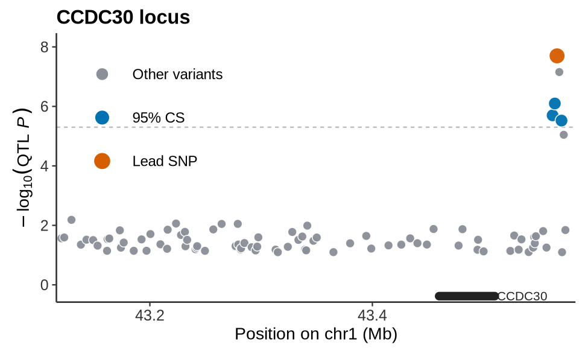

# EasyColoc

**Version & Registry**

[](CITATION.cff) [](https://github.com/cupcake777/EasyColoc)

**Environment**

[](environment.yml) [](environment.yml) [](docs/REFERENCE_COMPATIBILITY.md)

**CI/CD & Quality**

[](https://github.com/cupcake777/EasyColoc/actions/workflows/smoke-lite.yml) [](#install)

**License**

[](LICENSE)

EasyColoc is a GWAS-to-QTL colocalization pipeline. It standardizes GWAS
summary statistics, queries tabix-indexed QTL resources, runs coloc ABF and
optional SuSiE follow-up, then writes tables, locus plots, RDS bundles, runtime
state, and an HTML report.

<p align="center">
  
</p>

## What It Does

- supports explicit `hg19` and `hg38` GWAS/QTL builds
- harmonizes GWAS inputs with the native EasyColoc harmonizer
- discovers loci with PLINK clumping on build-matched LD panels
- queries QTL allPairs/sigPairs files through tabix
- matches variants by rsID, hash/position rescue, or position plus alleles
- runs coloc ABF and writes optional SuSiE summaries
- generates runtime state, output manifests, plots, RDS files, and reports

## Repository Structure

| Path | Purpose |
| --- | --- |
| `easycoloc` | Unified command-line entrypoint |
| `run_coloc.r` | Main pipeline runner |
| `src/` | R modules for config, harmonization, matching, coloc, plotting, reporting, and runtime state |
| `tools/` | Operational helpers: doctor, refs, bootstrap, monitor, manifest, report-web, harmony QC |
| `config/` | Portable default configs and metadata tables |
| `tests/` | Parse checks, smoke tests, and small fixtures |
| `docs/` | Tutorial, architecture, reference setup, and Docker notes |
| `examples/` | Minimal synthetic plotting demo |
| `web/` | Local interactive report UI source |

Local run artifacts are ignored by git and may appear after analysis:
`results/`, `temp/`, `harmony/`, `logs/`, `data/`, `config/local/`, `web/dist/`, and
`web/node_modules/`.

## Install

```bash
micromamba create -f environment.yml
micromamba activate easycoloc
```

Then verify the repository:

```bash
./easycoloc doctor
./easycoloc smoke
```

## Quick Demo

Create and run a self-contained toy project:

```bash
./easycoloc bootstrap-refs --demo ./demo_quickstart --run
```

Expected key outputs:

- `demo_quickstart/results/coloc_report.html`
- `demo_quickstart/results/all_colocalization_results.csv`
- `demo_quickstart/results/plots/*.pdf`
- `demo_quickstart/results/rds/*.rds`

## Typical Real Run

1. Prepare or bootstrap references.
2. Edit `config/global.yml`, `config/gwas.yml`, and `config/qtl.yml`, or use
   private overrides under `config/local/`.
3. Check paths and tools.
4. Run the pipeline.
5. Inspect outputs or launch the report web UI.

```bash
./easycoloc refs --include-qtl-files
./easycoloc doctor
./easycoloc run --managed
./easycoloc report-web results
```

For machine-specific paths:

```bash
./easycoloc run --managed \
  --global config/local/global.yml \
  --gwas config/local/gwas.yml \
  --qtl config/local/qtl.yml
```

## Main Commands

| Command | Purpose |
| --- | --- |
| `./easycoloc run [--managed]` | Run the coloc pipeline |
| `./easycoloc doctor` | Validate configs, input paths, references, and tools |
| `./easycoloc refs [--include-qtl-files]` | List required reference resources |
| `./easycoloc bootstrap-refs ...` | Materialize references or create demo projects |
| `./easycoloc check RESULTS_DIR` | Check whether a run completed cleanly |
| `./easycoloc status RESULTS_DIR` | Summarize outputs and task state |
| `./easycoloc monitor RESULTS_DIR` | Print a runtime/output snapshot |
| `./easycoloc watch RESULTS_DIR [SECONDS] [LOG]` | Poll monitor snapshots repeatedly |
| `./easycoloc manifest RESULTS_DIR` | Build an output manifest |
| `./easycoloc harmony-qc ...` | QC reusable harmonized GWAS caches |
| `./easycoloc report-web RESULTS_DIR` | Launch the local interactive report |
| `./easycoloc init TARGET_DIR` | Scaffold a portable project |
| `./easycoloc smoke` | Run the standard smoke suite |

## Harmonized GWAS QC

EasyColoc stores reusable GWAS harmonization caches in `harmony/`. The current
canonical schema includes:

```text
SNPID variant_id CHR POS EA NEA EAF BETA SE P N
```

Run QC after cache generation:

```bash
./easycoloc harmony-qc \
  --global config/global.yml \
  --gwas config/gwas.yml \
  --qtl config/qtl.yml \
  --output-dir results/harmony_qc \
  --sample-n 200000 \
  --dbsnp-sample-n 5000
```

The QC command writes an HTML report plus TSV summaries under the selected
output directory.

## Key Outputs

| Output | Meaning |
| --- | --- |
| `all_colocalization_results.csv` | Merged ABF coloc results |
| `significant_colocalizations_PP4_*.csv` | PP4-thresholded hits |
| `all_susie_results.csv` | Merged SuSiE summaries, when available |
| `plots/*.pdf` or `plots/*.png` | Locus plots |
| `rds/*.rds` | Serialized locus bundles |
| `coloc_report.html` | Static HTML report |
| `report_web/report-data.json` | Data payload for the local report UI |
| `runtime/` | Heartbeat, event log, and task state |
| `output_manifest.tsv` | Inventory of generated outputs |

## Documentation

- [Tutorial](docs/TUTORIAL.md)
- [Architecture](docs/ARCHITECTURE.md)
- [Reference data](docs/REFERENCE_DATA.md)
- [Reference compatibility](docs/REFERENCE_COMPATIBILITY.md)
- [Docker](docs/DOCKER.md)
- [Config layout](config/README.md)
- [Tests](tests/README.md)

## Validation

Run the full local smoke suite:

```bash
./easycoloc smoke
```

If localhost sockets are unavailable, use the lighter subset:

```bash
Rscript tests/check_parse.R
bash tests/smoke_test_cli.sh
Rscript tests/smoke_test_report_web_data.R
```
