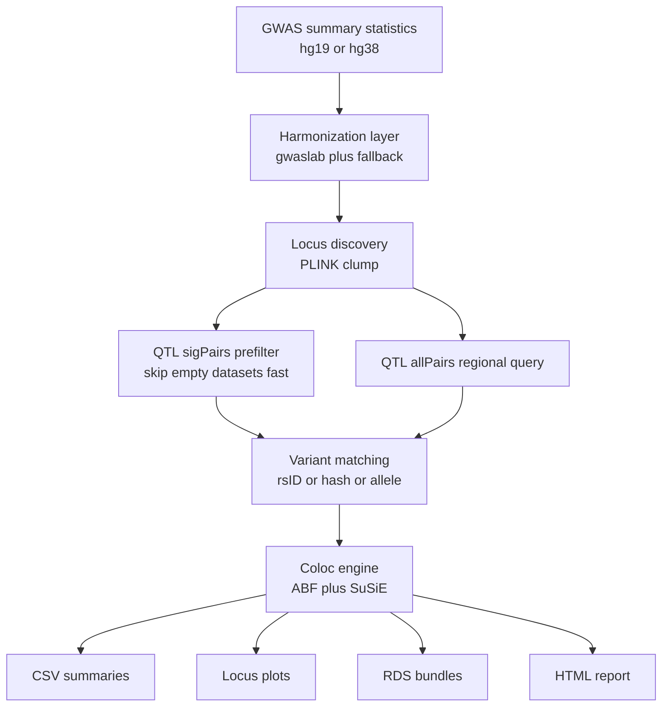

# EasyColoc

[](https://github.com/cupcake777/EasyColoc/actions/workflows/smoke-lite.yml)
[](LICENSE)
[](docs/REFERENCE_COMPATIBILITY.md)

EasyColoc is a practical GWAS-to-QTL colocalization pipeline built for real
inputs rather than idealized examples. It focuses on two recurring pain points:

1. Public GWAS summary statistics often arrive in inconsistent `hg19`-era formats.
2. Many coloc workflows stop at `coloc.abf` and never carry signal-level follow-up through `SuSiE`.

EasyColoc standardizes GWAS inputs, queries tabix-indexed QTL resources, and
produces ABF and SuSiE results together with plots, manifests, runtime
snapshots, and an HTML report.

## Fast Start For Existing Results

If you already have a finished `results/` directory, open the local web report with:

```bash
./easycoloc report-web /path/to/results
```

This command generates or refreshes `report_web/report-data.json` under the
target results directory, then starts a local report web server.

## Scientific Guardrails

- reference-aware handling of `hg19` and `hg38` GWAS/QTL combinations
- explicit support for build-matched LD panels, recombination maps, and gene annotations
- smoke fixtures that preserve coordinate and population compatibility instead of using visually convenient placeholders

Reference matching rules and fixture design notes:

- [docs/REFERENCE_COMPATIBILITY.md](docs/REFERENCE_COMPATIBILITY.md)
- [tests/fixtures/README.md](tests/fixtures/README.md)

## At A Glance

| If you want to... | Run this |
| --- | --- |
| open an existing results directory in the local web report | `./easycoloc report-web /path/to/results` |
| confirm the repo works locally | `./easycoloc smoke` |
| create the recommended local environment | `micromamba create -f environment.yml` |
| inspect required references and tools | `./easycoloc refs` and `./easycoloc doctor` |
| create a self-contained demo | `./easycoloc bootstrap-refs --demo ./demo_quickstart --run` |
| run the full pipeline with managed logging | `./easycoloc run --managed` |
| monitor an existing results directory | `./easycoloc status`, `./easycoloc monitor`, `./easycoloc watch` |

## Why EasyColoc

- `hg19` and `hg38` GWAS support with harmonization and fallback handling
- ABF + SuSiE in one pipeline instead of ABF-only coloc
- Build-aware 1000 Genomes bootstrap for `hg19` and `hg38`
- GTEx metadata bootstrap that can generate QTL summary CSVs and a ready-to-use YAML
- Managed runs with runtime heartbeat, manifest, monitor snapshot, and completion checks
- Demo mode that creates a tiny self-contained project and runs to HTML report

## 2-Minute Quickstart

### 1. Validate the installation

```bash
micromamba create -f environment.yml
micromamba activate easycoloc
./easycoloc refs
./easycoloc doctor
./easycoloc smoke
```

### 2. Create a self-contained demo

```bash
./easycoloc bootstrap-refs --demo ./demo_quickstart --run
```

This creates a tiny chr22 project, runs the pipeline end to end, and writes:

- `results/coloc_report.html`
- `results/all_colocalization_results.csv`
- `results/all_susie_results.csv`

### 3. Build a real reference panel

```bash
./easycoloc bootstrap-refs --setup-1kg ./refs/1kg_phase3_hg19 --build hg19 --pop EAS --chromosomes 1-22
./easycoloc bootstrap-refs --setup-1kg ./refs/1kg_phase3_hg38 --build hg38 --pop EAS --chromosomes 1-22
```

### 4. Prepare GTEx metadata

```bash
./easycoloc bootstrap-refs \
  --fetch-gtex-meta ./refs/gtex_meta \
  --gtex-eqtl-dir /path/to/gtex/eqtl \
  --gtex-sqtl-dir /path/to/gtex/sqtl
```

This downloads the GTEx sample attributes file, builds summary CSVs, and
generates `qtl_gtex_generated.yaml`.

## Typical Workflow

```text
validate environment
  -> bootstrap or point to references
  -> configure GWAS and QTL metadata
  -> run coloc
  -> inspect progress
  -> review merged results and report
```

## Architecture



See [ARCHITECTURE.md](docs/ARCHITECTURE.md) for a fuller description.

## Example Output

The plotting style below is generated from the repository's synthetic smoke
fixture with explicit `hg38 chr1` coordinates, `CHB` recombination context, and
matched gene-track coordinates.


## Main Commands

| Command | Use it for |
| --- | --- |
| `./easycoloc run --managed` | Full pipeline run with managed logging and completion checks |
| `./easycoloc check /path/to/output_dir` | Determine whether a run finished cleanly |
| `./easycoloc status /path/to/output_dir` | Summarize per-GWAS progress and output counts |
| `./easycoloc monitor /path/to/output_dir` | Print the latest runtime heartbeat and output snapshot |
| `./easycoloc watch /path/to/output_dir 60 logs/monitor/my_run.log` | Append periodic monitor snapshots to a local log |
| `./easycoloc manifest /path/to/output_dir` | Build an output manifest for an existing results directory |
| `./easycoloc refs --include-qtl-files` | Inspect required and optional references |
| `./easycoloc bootstrap-refs ...` | Materialize local references or demo assets |
| `./easycoloc smoke` | Run the standard local smoke suite |

## Repository Layout

- `src/`: core R modules
- `tools/`: executable helper scripts
- `tests/`: smoke and regression tests
- `config/`: portable public defaults plus generated examples
- `data/`: optional local input staging area for ad hoc runs
- `docs/`: user-facing documentation
- `examples/`: minimal demos
- `templates/`: `easycoloc init` scaffold

Detailed layout notes are in [REPO_LAYOUT.md](docs/REPO_LAYOUT.md).

## Key Outputs

| Output | Meaning |
| --- | --- |
| `all_colocalization_results.csv` | merged locus-level ABF coloc results |
| `significant_colocalizations_PP4_*.csv` | thresholded coloc hits |
| `all_susie_results.csv` | merged SuSiE output |
| `plots/*.pdf|png` | locus plots |
| `rds/*.rds` | serialized locus bundles for rerendering or inspection |
| `coloc_report.html` | interactive report |
| `output_manifest.tsv` | machine-readable output inventory |

## Documentation

- [TUTORIAL.md](docs/TUTORIAL.md)
- [ARCHITECTURE.md](docs/ARCHITECTURE.md)
- [REFERENCE_DATA.md](docs/REFERENCE_DATA.md)
- [DOCKER.md](docs/DOCKER.md)

## Validation

Run the standard local validation suite:

```bash
./easycoloc smoke
```

This now runs `tests/smoke_test_report_web_cli.sh`, which launches the report web CLI via
localhost sockets. Sandboxes that cannot bind/connect to localhost will see this step fail.

If you lack socket/localhost access, run the lighter subset below instead:

```bash
Rscript tests/check_parse.R
bash tests/smoke_test_cli.sh
Rscript tests/smoke_test_report_web_data.R
```

Those cover the parse-only and CLI-focused checks without touching localhost sockets.

For a test inventory and per-file coverage notes, see
[tests/README.md](tests/README.md).

For config layering and local-private override guidance, see
[config/README.md](config/README.md).

To monitor an existing results directory without writing into that directory:

```bash
./easycoloc watch /path/to/output_dir 60
```
