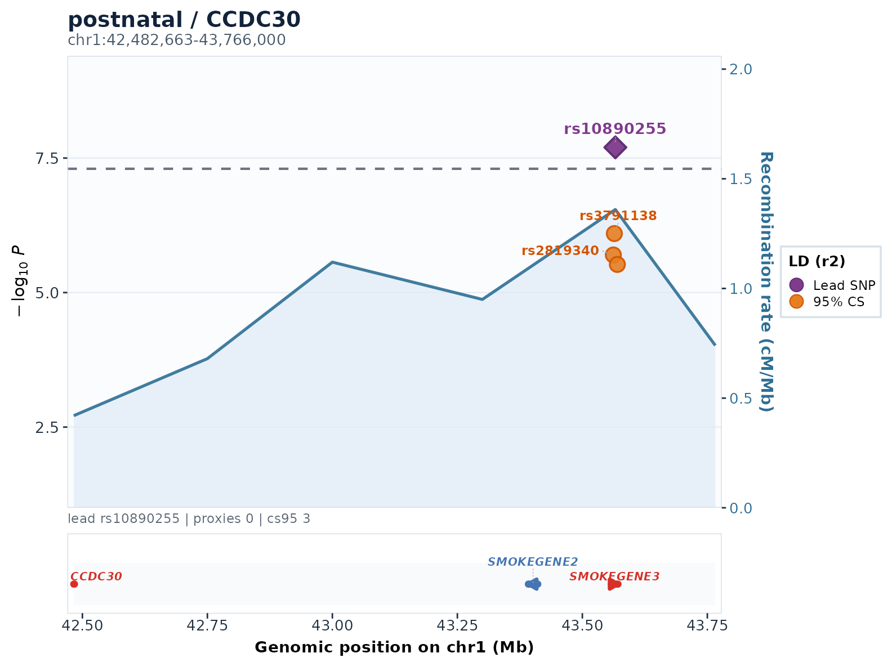

# EasyColoc

EasyColoc is a command-line pipeline for GWAS-to-QTL colocalization. It takes GWAS summary statistics and tabix-indexed QTL files, harmonizes variants, runs coloc ABF analysis, optionally runs SuSiE follow-up, and writes tables, plots, reports, and reusable R objects.

<p align="center">
  
</p>

## What It Does

- Checks that your GWAS, QTL, LD panel, allele-frequency, and annotation files are consistent.
- Handles `hg19` and `hg38` inputs explicitly, so coordinate-build mistakes are easier to catch.
- Harmonizes GWAS variants and reuses harmonized cache files across runs.
- Queries QTL `allPairs` and `sigPairs` files efficiently with tabix.
- Produces coloc result tables, locus plots, static HTML summaries, and an interactive local report.

## Install

Use `micromamba`, `mamba`, or `conda`:

```bash
micromamba create -f environment.yml
micromamba activate easycoloc
```

Check that the command-line tools and R packages are available:

```bash
./easycoloc doctor
```

For a fuller repository self-check, run:

```bash
./easycoloc smoke
```

## Try The Demo

This creates a small self-contained project and runs it:

```bash
./easycoloc bootstrap-refs --demo ./demo_quickstart --run
```

After it finishes, open or inspect:

| Output | Location |
| --- | --- |
| HTML report | `demo_quickstart/results/coloc_report.html` |
| Main coloc table | `demo_quickstart/results/all_colocalization_results.csv` |
| Significant hits | `demo_quickstart/results/significant_colocalizations_PP4_*.csv` |
| Locus plots | `demo_quickstart/results/plots/` |
| Saved R objects | `demo_quickstart/results/rds/` |

## Run Your Own Data

1. Create a clean project directory:

```bash
./easycoloc init /path/to/my_easycoloc_project
```

2. Edit the three YAML files in that project:

| File | What you set there |
| --- | --- |
| `config/global.yml` | output directory, reference files, thresholds, plotting options |
| `config/gwas.yml` | GWAS file paths, column names, build, population, sample size |
| `config/qtl.yml` | QTL metadata, tabix file columns, QTL build, QTL phenotype mapping |

3. List required files, then validate the paths and settings:

```bash
./easycoloc refs \
  --global /path/to/my_easycoloc_project/config/global.yml \
  --gwas /path/to/my_easycoloc_project/config/gwas.yml \
  --qtl /path/to/my_easycoloc_project/config/qtl.yml \
  --include-qtl-files

./easycoloc doctor \
  --global /path/to/my_easycoloc_project/config/global.yml \
  --gwas /path/to/my_easycoloc_project/config/gwas.yml \
  --qtl /path/to/my_easycoloc_project/config/qtl.yml
```

4. Generate harmonized GWAS cache files:

```bash
./easycoloc harmonize \
  --global /path/to/my_easycoloc_project/config/global.yml \
  --gwas /path/to/my_easycoloc_project/config/gwas.yml \
  --qtl /path/to/my_easycoloc_project/config/qtl.yml
```

This writes `*_harmonized.tsv.gz` and `harmonized_gwas_manifest.tsv` under `global.yml -> harmonize_dir`. Existing uncompressed `*_harmonized.tsv` caches are still readable.

5. Run the analysis:

```bash
./easycoloc run --managed \
  --global /path/to/my_easycoloc_project/config/global.yml \
  --gwas /path/to/my_easycoloc_project/config/gwas.yml \
  --qtl /path/to/my_easycoloc_project/config/qtl.yml \
  --output-dir /path/to/my_easycoloc_project/results
```

6. Check the run and open the report:

```bash
./easycoloc check /path/to/my_easycoloc_project/results
./easycoloc report-web /path/to/my_easycoloc_project/results
```

## Main Outputs

| Output | Meaning |
| --- | --- |
| `all_colocalization_results.csv` | all merged coloc ABF results |
| `significant_colocalizations_PP4_*.csv` | coloc hits passing the configured PP4 threshold |
| `all_susie_results.csv` | SuSiE summaries, if SuSiE is enabled |
| `plots/` | regional locus plots |
| `rds/` | saved R objects for downstream inspection and plot regeneration |
| `coloc_report.html` | static HTML report |
| `report_web/report-data.json` | data file used by the interactive report UI |
| `runtime/` | heartbeat, event log, and task-state files for monitoring |
| `output_manifest.tsv` | inventory of generated files |

## Common Commands

| Command | Use it when you want to |
| --- | --- |
| `./easycoloc init TARGET_DIR` | create a new analysis project |
| `./easycoloc refs --include-qtl-files` | list required reference and QTL files |
| `./easycoloc doctor` | validate config paths, tools, and reference files |
| `./easycoloc harmonize` | generate harmonized GWAS cache files only |
| `./easycoloc run --managed` | run the full pipeline with managed logs and runtime state |
| `./easycoloc run --managed --shard-count N --shard-index I` | run one resumable locus shard for SLURM array-style execution |
| `./easycoloc run --emit-slurm-array-template --shard-count N` | print a SLURM array template for shard execution |
| `./easycoloc finalize RESULTS_DIR` | merge, report, manifest, and check outputs after shard runs |
| `./easycoloc clean RESULTS_OR_PROJECT_DIR` | dry-run safe cleanup of stale summaries and run temp files |
| `./easycoloc status RESULTS_DIR` | summarize progress and output counts |
| `./easycoloc monitor RESULTS_DIR` | print the latest runtime snapshot |
| `./easycoloc check RESULTS_DIR` | check whether a run completed cleanly |
| `./easycoloc manifest RESULTS_DIR` | build an output manifest |
| `./easycoloc report-web RESULTS_DIR` | launch the local interactive report |
| `./easycoloc harmony-qc ...` | build QC summaries for harmonized GWAS cache files |
| `./easycoloc smoke` | run the repository smoke tests |

## Reference Data Checklist

Before a real run, make sure these match the same genome build and population assumptions:

| Item | Config location |
| --- | --- |
| GWAS build | `gwas.yml -> datasets[].build` |
| QTL build | `qtl.yml -> qtl_info.build` |
| LD panel | `global.yml -> plink_hg19` or `global.yml -> plink_hg38` |
| LD sample list | `global.yml -> plink_keep`; PLINK `--keep` file, recommended two columns `FID IID`; one-column `IID` is accepted and converted at runtime |
| LD PLINK timeout | `global.yml -> runtime.ld_plink_timeout`; max seconds for each PLINK LD matrix/plot extraction before skipping that LD call |
| allele frequency | `global.yml -> 1kg_af` |
| gene annotation | `global.yml -> gene_anno` |
| recombination map | `global.yml -> recom` |

Do not mix `hg19` and `hg38` coordinates unless the input has been lifted over and checked.

## More Documentation

- [Tutorial](docs/TUTORIAL.md)
