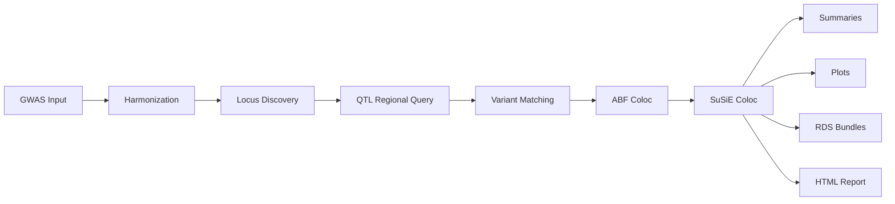

# Architecture

## Design Goal

EasyColoc is meant to make real coloc work operational, not just statistically
possible. The pipeline is therefore organized around four stages:

1. Normalize messy GWAS inputs
2. Minimize unnecessary QTL scanning
3. Run both ABF and SuSiE coloc
4. Leave behind outputs that are easy to inspect and hand off

## Pipeline Overview

## Main Components

### 1. Harmonization

- Implemented in `run_coloc.r` and `src/utils_format.R`
- Uses `gwaslab` when reference assets are available
- Supports fallback handling for liftOver-related failure paths
- Keeps build-aware reference selection explicit

### 2. Locus Discovery

- Uses PLINK clumping on a build-matched 1000 Genomes panel
- Build-aware PLINK reference selection now supports both `plink_hg19` and `plink_hg38`
- Population-specific keep files are reused for both clumping and SuSiE LD

### 3. QTL Query Layer

- QTL data are expected as tabix-indexed allPairs/sigPairs files
- `sigPairs` prefiltering is enabled by default to avoid expensive allPairs scans when a dataset has no local signal
- Relative QTL metadata paths are resolved robustly for portable projects

### 4. Variant Matching

EasyColoc uses a three-tier match strategy:

1. direct rsID overlap
2. rsID rescue through dbSNP hash tables
3. position + allele matching

This layer is the bridge between inconsistent GWAS inputs and consortium-style
QTL files.

### 5. Coloc Engine

- ABF coloc is always attempted
- SuSiE coloc is triggered when signal strength and LD prerequisites are met
- Credible set extraction and plotting hooks are integrated into the same run

### 6. Output Layer

| Output type | Purpose |
| --- | --- |
| merged CSV summaries | downstream analysis and filtering |
| SuSiE tables | fine-mapping review |
| locus plots | visual interpretation and handoff |
| serialized RDS bundles | rerendering and debugging |
| runtime tracker files | monitoring and auditing |
| HTML report | compact review artifact |
| output manifest | machine-readable output inventory |

## Bootstrap Layer

Bootstrap functionality is a first-class part of the architecture:

- `--demo`: creates a toy project and can run it end to end
- `--setup-1kg`: downloads build-specific 1000 Genomes VCFs and converts them to PLINK
- `--fetch-gtex-meta`: downloads GTEx sample attributes and can generate QTL summary metadata plus YAML

These paths live primarily in:

- `tools/bootstrap_references.R`
- `src/utils_bootstrap.R`
- `src/utils_download.R`

## Runtime And Observability

EasyColoc tracks long runs explicitly:

- `active_run.json`
- `heartbeat.json`
- `task_state.tsv`
- `event_log.ndjson`
- `monitor_snapshot.json`

This keeps the pipeline inspectable without scraping unstable console output.

## What Is Deliberately Not In Scope

- full GWAS munging feature parity with gwaslab
- storage of large reference assets inside the repository
- implicit magic around build inference when explicit configuration is safer
